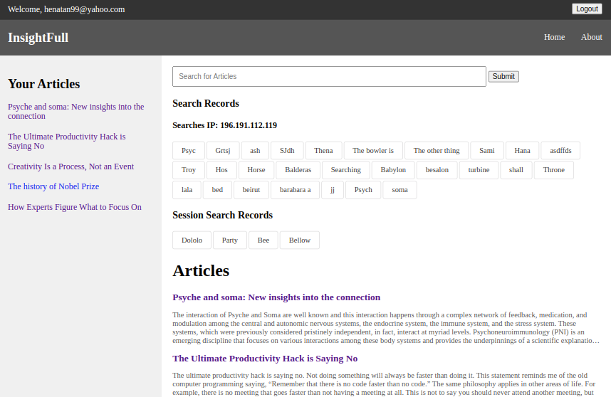

# Search Engine Analytics 

This is a Ruby on Rails Test Project for Helpjuice ti build a search engine analytics app. 

## App Features

### Articles page
- Articles page is the main page where all the articles are listed whether a user is signed in or not.


#### Search engine
- The articles page has search input where users can make instance searches. 
- The input event triggers api fetch of all articles filtered by the search input query 
- In addition the input event also triggers recording searches by avoiding 'pyramid problem' by comparing each input state with the existingSearches in the sessionStorage. 
- Then the existingSearches will be sent to database via api post request and sessionStorage is renewed when 
    (a) submit action is invoked either by button or by pressing 'Enter' key
    (b) when page is refreshed
    (c) when page/browser is closed
- The articles page also displayes the list of search keywords from api corresponsing to the users ip_address


### Article show page
- Users can also view article page of any article regardless of autherntication or autorization
- But only authenticated and owner of the article can edit or delete the article


### New Article page
- Authenticated (logged in) users can create article. user_id is required to create article


## Problem Description

- To create a realtime search box, where users search articles, and then to have analytics that display what users were searching for. You can also track via IP - no need to create a devise, etc.

- Your goal is to record their input in realtime and ultimately display analytics & trends on what people are searching for the most. (this is not about search itself, but really about analytics behind it). 

- It’s per user - so don't blend other users data

- Don’t worry too much about populating it with articles, we only really care about the search, and search analytics. We don’t care how good your search engine is, but rather how good your algorithm for figuring out what people searched for. Search should be instant, and every search should be logged, regardless of what they type, but you should capture and summarize the searches so you dont have the ‘pyramid problem’

- Hint: Because the search is real time, queries will be coming in segments, as listed in the example below

- Bonus: You should expect thousands of requests per hour, so think of scalability. 
- Bonus: Test your app with Rspec.

- Example input <--> output
```
1. Belows are the input/output good & bad examples. 
2. If we test your app, and it behaves in a bad example, we won't hire you.  
3. Keep in mind that some users type slowly, but some users type. It's up to you to engineer around that -- your solution should be fail proof.
4. It should be instant search & results though.   
5. Better to over-engineer than to be lazy-engineer. Most importantly is to finish in the timeframe and fast. 
```

## Stadards

- TEST. Your. App.
-  GOOD Code. We can’t stress this enough. 
- Documented code. We don’t expect you to write a novel, but at least remove the default Rails README
- Scalability 
- Deploy on Heroku or w/e for easier testing. Remember, it’s all about making the user’s life easier (in this case, us -- reviewing your code)

## Project Solution

- The project is initialized with: `rails new search-analytics-rails --database=postgresql`


### Active record Models 
- The database model should have be like
1. User model for users table which has many searches
   The `user` should have at least a unique IP, so authentication may not be required
   - To generate the User model: `rails generate model User email:string first_name:string last_name:string password:string`
   - Validation for the User model: 
    ```
        class User < ApplicationRecord
            has_many :searches
            has_many :articles
            validates :email, presence: true, uniqueness: true

            # other attributes if needed
        end
    ```

2. Search model for searches table which belongs to many users
   - The `searchs` table just collects data which is basically keywords or a phrase, that is related to specific user ip_address.
   - Since the search engine does not necessarily need user auth and track search via ip_address, it is better to associate the searches table with ip_address instead of user. 
   - Two options are possible,
        1. Making ip_address as an attribute of Search model 
            - `rails generate model Search keyword:string user_id:string ip_address:string`
            - The Search model looks like 
            ```
                class Search < ApplicationRecord
                    validates :keyword, presence: true
                    validates :ip_address, presence: true

                    # Other attributes if any
                end
            ```
        2. Set up a one-to-many relationship between  IP addresses and searches.A search can belong to only one IP addresses, and an IP address has many searches. 

            - `rails generate model IpAddress address:string`
            - `rails generate model Search query:string user:references ip_address:references`

            - The IpAddress models look like 
            ```
                class IpAddress < ApplicationRecord
                    has_many :searches
                    validates :address, presence: true

                    # Other attributes if any
                end
            ```
            - The Search model looks like
            ```
                class Search < ApplicationRecord
                    belongs_to :user, optional: true
                    belongs_to :ip_addresses
                    validates :keyword, presence: true

                    # Other attributes if any
                end
            ```
        - In this case capturing the search data with multiple IP addresses
        ```
            def perform_search 
                keyword = params[:search_keyword]
                ip_address = request.remote_ip 

                search = Search.create(keyword: keyword)

                ip_address_record = IpAddress.find_or_create_by(address: ip_address)

                search.ip_addresses << ip_address_record
            end
        ```
3. Article model for articles table belongs to a user
    - `rails generate model Article title:string body:text user:references`
    - The Article model looks like
        ```
            class Article < ApplicationRecord
                validates :title, presence: true
                validates :body, presence: true
            end
        ```
### The search engine query 

- It should adress the statements 

1. Search should be instant
2. every search should be logged, regardless of what they type, 
3. but you should capture and summarize the searches so you dont have the ‘pyramid problem’
4. Because the search is real time, queries will be coming in segments, as listed in the example below
    - (1st (random) user searches for)
        `What is` 
        `What is a` 
        `What is a good car`  
    - (2nd (random) user searches for:)
        `How is`
        `Howis emil hajric` 
        `How is emil hajric doing` 

5. The search engine only records the filtered one 
    - Your search engine only records: 
        `What is a good car`
        `How is emil hajric doing` 
    - (And removes the rest because it was an incomplete search )

- To address this issue

#### Search that compares nearest words
- For approximate/near matches and handling typos or/and mis-spellings the rails `fuzzy-match` gem can be used

- Add `gem 'fuzzy_match'` in your gemfile and run `bundle install`
- Implement the fuzzy_match in your ArticlesController
```
    class ArticlesController < ApplicationController
        def index
            search_query = params[:query]
            matching_searches = find_similar_articles(search_query)

            # logic to handle matching searches like filtering articles and loging search
        end

        private

        def find_similar_searches(query)
            all_articles = Article.all

            fuzzy_matcher = FuzzyMatch.new(all_articles, read: :to_tokens)
            similar_articles = fuzzy_matcher.find(query, threshold: 0.8)

            # Filter out exact matches to avoid duplicates 
            similar_articles.reject { |match| match.title.casecmp(query).zero? && match.body.casecmp(query).zaro? }
        end
    end
```
- In this case the `Article` model should implement `to_tokens` method.
```
    class Article < ApplicationRecord
        belongs_to :user

        def to_tokens
            "#{title} #{body}".split(/\W+/)
        end
    end
```

- For normal match the controller becomes 

```
    class ArticlesController < ApplicationController
        def index
            @articles = Article.all
        end

        def search
            query = params[:query]
            @matching_articles = Article.where('lower(title) LIKE :query OR lower(body) LIKE :query', query: "%#{query.downcase}%")
        end
    end
```

Optionally defining the search method inside the model instead of the controller to keep the controller cleaner 

```
    class Article < ApplicationRecord
        # ... other model code ...

        def self.search(query)
            where('lower(title) LIKE :query OR lower(body) LIKE :query', query: "%#{query.downcase}%")
        end
    end
```

```
    class ArticlesController < ApplicationController
        def index
            @articles = Article.all
        end

        def search
            query = params[:query]
            @matching_articles = Article.search(query)
        end
    end
```
#### Vanilla JavaScript to dynamically render articles and record search

#### `importmap-rails` to separate js script code from views
- Importmap for Rails is automatically included in Rails 7+ for new applications
- Add `src` folder inside `app/javascript`
- Add `searchEngine.js` file inside the `src` folder which has the wrapper script code
    ```
        document.addEventListener('turbo:load', function() {
            ...
        })
    ```
- In your `config/importmap.rb` file pin all js files that are inside source
    `pin_all_from 'app/javascript/src', under: 'src'`
- In your `app/javascript/application.js` import the main script file `searchEngine.js`
    `import 'src/searchEngine'`
- Make sure the import map tag is present in the `application.html.erb` head tag
    ```
        <head>
            ...
            <%= javascript_importmap_tags %>
        <head>
    ```

## Routes 

- Two main routes are there for now. The users and the articles routes. 
- The articles route is the page to display list of articles and also have search input 
- The users routes is for authenticated users who can create articles 

##  Deploy to heroku 
- Create `Procfile`
- Copy and paste   `web: bundle exec puma -C config/puma.rb`

## [Live demo](https://search-analytics-rails-74733d3ea510.herokuapp.com/)

## Built With

- Ruby on Rails 
- RSpec

## Getting Started
The usage of this program is simple. 

### Prerequisites

- Ruby
- Rails 
- Vanilla JS 

## Setup

### running with local server 
- git clone https://github.com/henatan99/search-analytics-rails.git 
- run bunddle install 
- run db:migrate 
- Once project is implemented 

**Run the code demonstrations below**

```bash
rails s 
```

**For console test demonstrations below**
```bash
rails c 
```

**For routes**
```bash
rails routes 
```
## Authors

👤 **Henok Mossissa**

- GitHub: [@henatan99](https://github.com/henatan99)
- Twitter: [@henatan99](https://twitter.com/henatan99)
- LinkedIn: [Henok Mossissa](https://www.linkedin.com/in/henok-mekonnen-2a251613/)

## :handshake: Contributing

Contributions, issues, and feature requests are welcome!

## Show your support

Give a :star:️ if you like this project!

## Acknowledgment 

- [Helpjuice](https://helpjuice.com/)

## :memo: License

This project is [MIT](./LICENSE) licensed.
